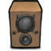

 joggle
-----------------------------------------------

joggle is a simple music player webapp.

needs java and maven to build.

1. check out the ``main`` branch or download the latest ``release``.
2. edit ``src/main/resources/joggle.properties`` to point to your music directory.
3. start with ``mvn jetty:run``.
4. open http://localhost:8080/joggle/ in your browser.

comes with a simple html page for easy browsing / playback.
