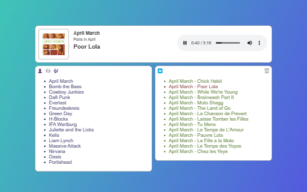

 joggle
-----------------------------------------------

joggle is short for "Java OGG LEnder"

joggle is a simple mp3 / ogg streaming webapp. needs java and maven to build.

1. check out http://joggle.googlecode.com/svn/trunk/ or download joggle-v0.02.zip.
2. edit ``src/main/resources/joggle.properties`` to point to your music directory.
3. start with ``mvn jetty:run``.
4. open http://localhost:8080/joggle/ in your browser.

comes with a simple html5 page for easy browsing / playback.

&#160;

